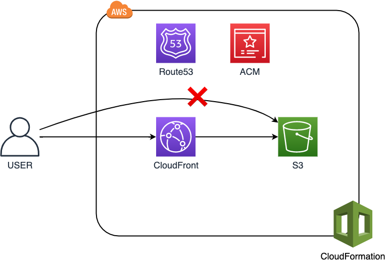

# s3-hosting

CloudFormationを使ってS3ホスティングをするテンプレート

## 前提条件

* ACMで証明書発行済み
* 独自ドメイン取得し、Route53に登録済み

## 入力するパラメータ

* HostZoneName
  * 事前にRoute53に登録しているホストゾーン名を入力
* SubDomain
  * 今回設定したいサブドメイン名を入力
* CFSSLCertificateId
  * ACMで設定している証明書の識別子を入力

## できること

* S3＋CloudFront構成のホスティング
* `サブドメイン.ホスト名`でアクセス可
* HTTPSへ自動リダイレクト
* S3への直アクセス禁止

## 構成図

